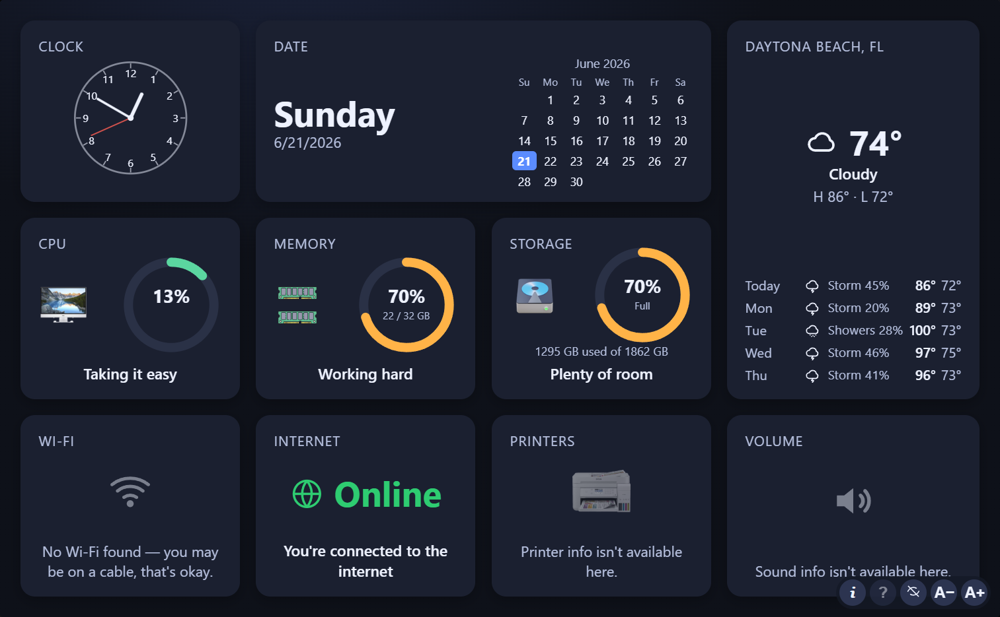
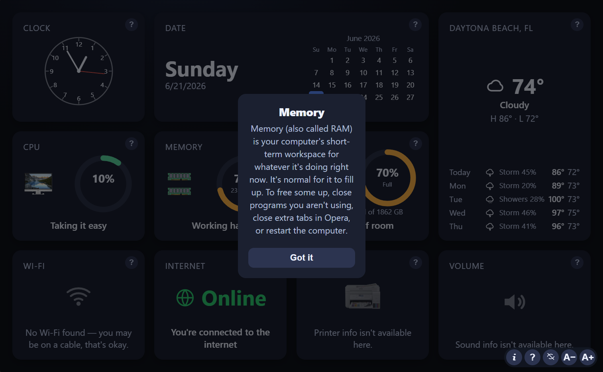

<div align="center">


# 👵 momPanel

**A calm, graphics‑first desktop info panel for people who find Settings intimidating.** 💛

[](https://github.com/kaislate/momPanel/releases/latest)
[](#-install)
[](#-install)
[](https://tauri.app)

</div>

---

momPanel shows the things that actually matter — at a glance, in plain language, with big friendly graphics instead of buried menus. It was built for a non‑technical user (hi, Mom 👋) who just wants to know *"is my computer okay?"* without hunting through control panels.

## ✨ Highlights

- 🖼️ **Graphics‑first tiles** — gauges, icons, and big readable numbers instead of walls of text.
- 🧪 **Companion mode (preview)** — a calmer, reimagined panel: a big clock and the weather up front, and one "All is well" card that only speaks up when something needs attention. Try it in **ℹ️ About → Preview**.
- 🚨 **Low‑memory guardian** — warns you *before* your computer runs low on memory, with an alert sound and a spoken heads‑up, and names the app hogging memory so you know what to close — even when momPanel is minimized.
- 🎨 **Make it yours** — pick a ready‑made theme (Midnight, Warm, High‑contrast) or set your own colors for the accent, background, tiles, and gauges.
- 🪟 **Frameless & tidy** — no window chrome to fumble with; put the panel where you like and it **remembers its spot** next time.
- 🗣️ **Plain language** — "Plenty of room", "You're connected to the internet", "Out of paper".
- ❓ **Per‑tile help** — a "?" on each tile pops a simple explanation of what it means.
- 🔠 **Make everything bigger** — one A− / A+ control scales the whole panel (and the window) for easy reading.
- 🧘 **Calm mode** — honors your system "reduce motion" setting.
- 🖱️ **Safe shortcuts** — friendly buttons that *open the right settings screen*; momPanel never changes settings itself.
- 🔄 **Auto‑updates** — quietly updates itself from GitHub Releases (signed).
- 🔒 **Private** — your weather ZIP is stored **only on your machine**, never bundled or shared.

## 🧩 The tiles

| Tile | What it shows |
|---|---|
| 🕒 **Clock** | Time, as a numbers display or an analog face (your choice) |
| 📅 **Date** | Today + a full month calendar with today highlighted |
| 🧠 **CPU** | How hard the processor is working right now |
| 🧩 **Memory** | How much short‑term memory (RAM) is in use — with an optional alert before it runs out |
| 💾 **Storage** | How full your drive is — tap to flip between % full and % free |
| 📶 **Wi‑Fi** | Network name and signal strength |
| 🌐 **Internet** | A clear Online / Offline indicator |
| 🖨️ **Printers** | Your printers and whether they're ready |
| 🔊 **Volume** | Current sound level / muted |
| ⛅ **Weather** | Now + a 7‑day forecast (°F) for your ZIP |

> 🐧 **Linux is the primary target** — every tile reads live system info there, in any system language. Windows (for development/testing) covers most tiles best‑effort; anything it can't read shows a friendly "not available here".

## 🚨 Low‑memory guardian

momPanel keeps an eye on memory in the background — even when it's minimized. Before your computer runs so low it could freeze, it gets your attention with a **critical notification, an alert sound, and a spoken warning** that names the app using the most memory (e.g. *"Memory usage high. Opera is using 4.3 gigabytes."*). If you don't act, it keeps reminding you and finally pops up a dialog. It's all adjustable in **ℹ️ About** — when it triggers (70–90% full), the sound and volume, speech on/off, and whether it repeats or escalates.

> 🐧 The alert sound, speech, and notification are Linux features (the primary target). On Windows this is a follow‑up.

## 🎨 Make it yours

Prefer a warmer look, or need higher contrast? Open **ℹ️ About → Theme** to pick a preset (**Midnight**, **Warm**, **High‑contrast**) or choose your own colors for the accent, background, tiles, and the usage gauges. Text automatically stays readable on whatever background you pick — and your colors reach every tile, gauge, and status dot.

## 🧪 Companion mode (experimental preview)

The classic panel shows everything, all the time. **Companion mode** flips that around: the things you actually glance at — the time, the date, the weather — are front and center, and all the technical tiles collapse into one calm **"All is well"** card. When something genuinely needs attention (the printer's out of paper, the sound is muted, you're offline), a plain‑language card appears with the right button — and disappears when it's sorted. The background sky even shifts gently from dawn to day to dusk to night.

Turn it on (or back off) anytime in **ℹ️ About → Preview** — momPanel refreshes when you switch.

## 🖼️ Screenshots

<div align="center">



<br/><br/>

❓ _Tap any tile's "?" for a plain‑language explanation_



</div>

## 🚀 Install

### 🐧 Linux / Zorin OS — primary target

1. Download **`momPanel_x.y.z_amd64.AppImage`** from the [latest release](https://github.com/kaislate/momPanel/releases/latest).
2. Make it executable and run it:
   ```bash
   chmod +x momPanel_*_amd64.AppImage
   ./momPanel_*_amd64.AppImage
   ```
   *(`.deb` and `.rpm` packages are also provided. The **AppImage** is the self‑updating one.)*

momPanel registers itself to **start automatically on login** and keeps itself **up to date**.

### 🪟 Windows — for testing

Download and run the **`_x64-setup.exe`** (or the `.msi`) from the [latest release](https://github.com/kaislate/momPanel/releases/latest).

## 🛠️ Build from source

**Prerequisites:** [Node.js](https://nodejs.org), the [Rust toolchain](https://rustup.rs), and the [Tauri system dependencies](https://tauri.app/start/prerequisites/) for your OS.

```bash
git clone https://github.com/kaislate/momPanel.git
cd momPanel
npm install

npm run tauri dev      # 🔧 run in development
npm run tauri build    # 📦 build installers for your platform
```

## 🔄 Updates

On launch, momPanel checks **GitHub Releases** for a newer **signed** version and installs it silently. You can also open the **ℹ️ About** panel to **Check for updates** manually or turn auto‑update off.

## 🔒 Privacy

- 📍 Your weather **ZIP code is stored only in your local config** (`~/.config/momPanel/` on Linux, `%APPDATA%\momPanel\` on Windows). It's never committed, bundled, or shared — it's sent only to the weather service to fetch your forecast.
- 🧾 No accounts, no tracking, no telemetry.

## 🏗️ How it's built

- **[Tauri](https://tauri.app)** — a tiny Rust shell around a system webview (low RAM for an always‑on panel).
- **Rust backend** — small, independent *collector* modules (one per concern) that return a uniform data shape; the frontend never sees OS differences.
- **Vanilla HTML/CSS/JS frontend** — no framework, no bundler.

```
src/            🎨 frontend (tiles, layout, styles)
src-tauri/      🦀 Rust backend (collectors, config, commands)
```

## 📜 License

A personal project, shared openly. 💛

---

<div align="center">
Made with care for Mom. 👵💙
</div>
